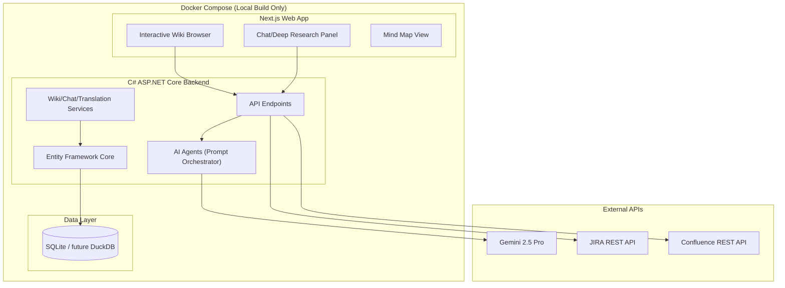

# Antigravity-DeepWiki — Implementation Plan v3

## Architecture Overview

**What each layer does:**
- **C# Backend**: The orchestration brain. It receives requests from the frontend, reads the local repo's file tree, feeds files to the LLM via the prompt templates, and stores generated wiki structure in the database.
- **Next.js Frontend**: The interactive browser UI you want to keep — clickable navigation, search, mind maps, chat.
- **SQLite**: Stores the wiki catalog tree, generated page content, repository metadata, and generation state. This is the application state, not just a cache.

---

## Prompt Pipeline Execution Order

The wiki generation pipeline executes these 4 prompts sequentially. Each is a markdown template in `src/OpenDeepWiki/prompts/`:

| Step | Prompt File | Purpose |
|------|-------------|---------|
| 1 | [catalog-generator.md](file:///Users/jc-vht/code_sandbox/antigravity-deepwiki/src/OpenDeepWiki/prompts/catalog-generator.md) | Scans repo structure, entry points, and README to build a hierarchical Table of Contents (catalog) for the wiki |
| 2 | [content-generator.md](file:///Users/jc-vht/code_sandbox/antigravity-deepwiki/src/OpenDeepWiki/prompts/content-generator.md) | For each catalog item, reads source files, analyzes architecture, and writes a full wiki page with Mermaid diagrams, code examples, and source attribution |
| 3 | [mindmap-generator.md](file:///Users/jc-vht/code_sandbox/antigravity-deepwiki/src/OpenDeepWiki/prompts/mindmap-generator.md) | Generates a hierarchical mind map of the project architecture with file path links |
| 4 | [incremental-updater.md](file:///Users/jc-vht/code_sandbox/antigravity-deepwiki/src/OpenDeepWiki/prompts/incremental-updater.md) | On subsequent runs, analyzes git diffs between commits and surgically updates only affected wiki pages |

Additionally, [api/prompts.py](file:///Users/jc-vht/code_sandbox/antigravity-deepwiki/api/prompts.py) contains 4 Python prompts for the interactive chat/research features (RAG system prompt, Deep Research first/intermediate/final iteration prompts, Simple Chat prompt).

> [!TIP]
> These 4 C# prompt templates are where persona customization will happen. For example, a "Business User" variant of `content-generator.md` would instruct the LLM to use plain language and focus on business outcomes rather than code internals.

---

## User Review Required

> [!IMPORTANT]
> **C# / SQLite Alternatives:** The C# backend is deeply integrated (Entity Framework, agent orchestration, MCP server). Replacing it would be a **full rewrite**, not a refactor. Recommendation: **Keep C# for now**, but plan a Phase 5 migration to **Python (FastAPI) + DuckDB** once the persona system is stable. DuckDB is excellent for analytical queries over wiki data and supports Parquet/Arrow natively. See analysis below.

> [!WARNING]
> **Interactive Diagrams:** Mermaid is static SVG. For zoomable, draggable, collapsible visualizations (data lineage, Airflow DAGs, ERDs), we'll need a JavaScript library in the frontend. **D2** generates static diagrams (not interactive). Better options: **React Flow** (drag-and-drop node graphs), **ELK.js** (hierarchical layout engine for DAGs), or **Cytoscape.js** (network graphs with zoom/pan). These can be added as new React components in the Next.js frontend.

---

## C# / SQLite Alternatives Analysis

| Current | Alternative | Effort | Benefit |
|---------|-------------|--------|---------|
| C# ASP.NET | **Python FastAPI** | High (full rewrite) | Team familiarity, simpler deployment, direct LLM SDK access |
| C# ASP.NET | **Go (Fiber/Echo)** | High | Faster binary, lower memory |
| SQLite | **DuckDB** | Medium | Analytical queries, columnar storage, Parquet import/export |
| SQLite | **PostgreSQL** | Low (already supported) | Better concurrency, full-text search, `pgvector` for embeddings |
| Entity Framework | **SQLAlchemy / Tortoise ORM** | High | Python-native, pairs with FastAPI |

**Recommendation:** Keep C# + SQLite for Phase 1-3. In Phase 5, migrate to **FastAPI + DuckDB** as the team gains confidence with the architecture.

---

## Proposed Changes

### Phase 1: Security & Docker Purification (Days 1-2)
- Strip `image:` tags from `compose.yaml` (remove `crpi-j9ha7sxwhatgtvj4.cn-shenzhen.personal.cr.aliyuncs.com` references)
- Remove OpenTelemetry packages from C# `.csproj` and `Directory.Packages.props`
- Set `NEXT_TELEMETRY_DISABLED=1` in all Dockerfiles
- Audit all outbound network calls in C# backend (grep for `HttpClient`, `RestClient`, etc.)

### Phase 2: De-internationalization (Days 3-5)
- Delete 9 non-English locale files (`zh.json`, `ja.json`, `kr.json`, `es.json`, `fr.json`, `ru.json`, `vi.json`, `zh-tw.json`, `pt-br.json`)
- Delete 11 non-English READMEs (`README.zh.md`, `README.ja.md`, etc.)
- Remove `i18n.ts` language-switcher logic, hardcode to English
- Translate Chinese comments in Dockerfiles and `compose.yaml` to English
- Remove `IMPORTANT:You MUST respond in {language_name} language` directives from Python prompts
- Translate Chinese strings in `mindmap-generator.md` example section to English
- **Export all 8 prompts** (4 C# + 4 Python) into a clean `docs/prompt-pipeline-reference.md` with execution order documentation

### Phase 3: Persona System (Days 6-9)
- Create persona-specific variants of `catalog-generator.md` and `content-generator.md`
- Add persona dropdown to Next.js frontend dashboard
- Wire persona selection through C# backend to prompt template selection
- Create 4 persona prompt sets: Data Engineer, Data Scientist, PM/Analyst, Business User

### Phase 4: Interactive Diagrams & Visualizations (Days 10-14)
- Evaluate and integrate **React Flow** or **Cytoscape.js** for interactive node-based diagrams
- Build data/table lineage visualization component (Raw → Staged → Analytical)
- Build Airflow DAG dependency visualizer (evaluate [airflow-diagrams](https://github.com/feluelle/airflow-diagrams))
- Add collapsible ERD table view component
- Create ELI5 mode for Business User persona (plain-language pipeline descriptions)

### Phase 5: Integrations & Future Architecture (Days 15+)
- **Confluence Sync**: Push wiki pages to Confluence Spaces via REST API, keep them "live"
- **JIRA Integration**: MCP/API connection for ticket selection → auto-create feature branch → comment ticket with branch link
- **JIRA SKILLS.md**: Template-based daily deployment summary (DEV → STG → PROD workflow)
- **Backend Migration Evaluation**: Prototype FastAPI + DuckDB replacement for C# + SQLite
- **Semantic Knowledge Graph**: Evaluate Neo4j or graph extensions for DuckDB to map code relationships

---

## Verification Plan

### Security
- `grep -r "aliyuncs.com" .` returns zero results
- `docker compose build` pulls only from `mcr.microsoft.com` and `node:20-alpine`
- Network monitor during wiki generation shows only outbound calls to `generativelanguage.googleapis.com`

### De-internationalization
- UI renders 100% in English, no language switcher visible
- Generated wiki output contains zero Chinese/CJK characters
- All prompt templates contain only English instructions

### Persona System
- Switch to "Business User" persona → wiki uses plain language, no code blocks
- Switch to "Data Engineer" persona → wiki emphasizes schemas, pipelines, configs
